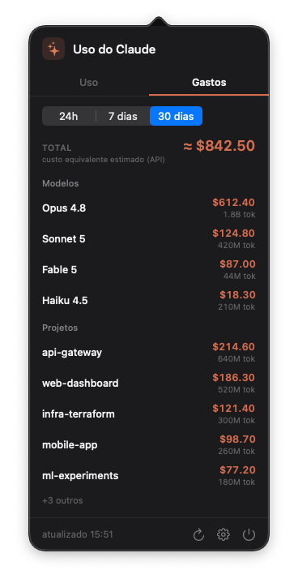
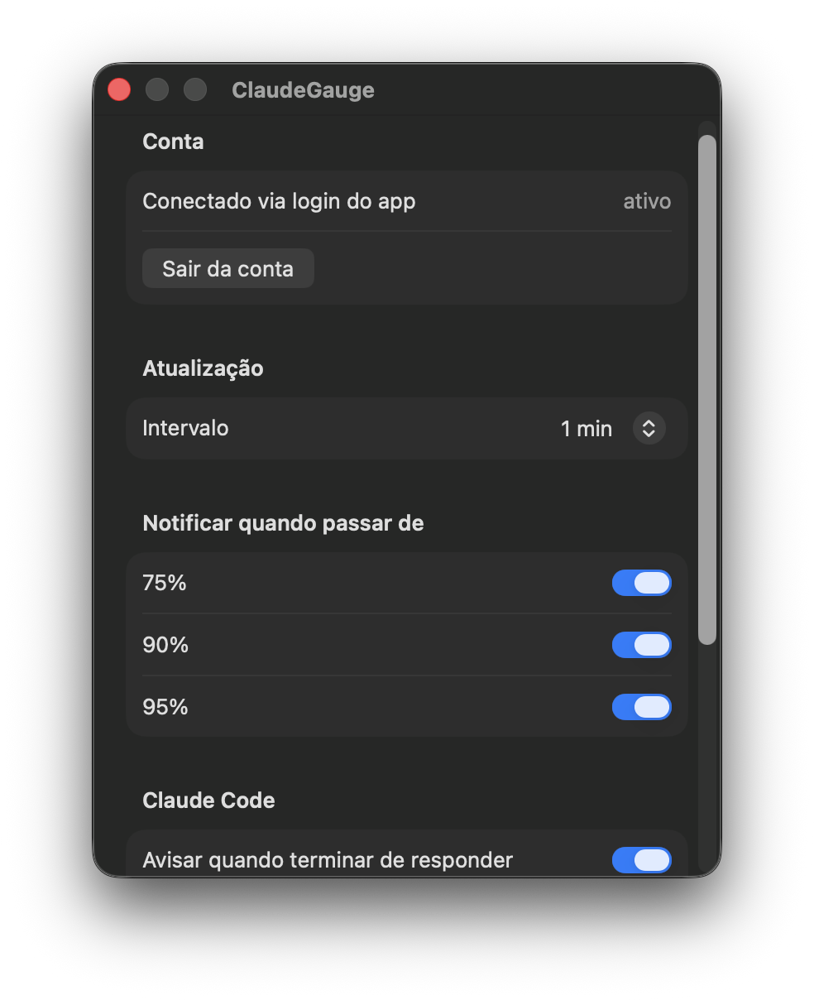

# ClaudeGauge

App de **menu bar (macOS)** / **bandeja (Linux)** que mostra o uso do seu Claude direto na barra do sistema — limites, sessões abertas e uma estimativa de custo por modelo e por projeto — sem precisar abrir `claude.ai/settings/usage` toda hora.

- **Na barra:** os dois limites de relance (`5h 5% ▬ · 4h49 · 7d 1% ▬`), com cor só na barra, o countdown do reset da janela de 5h, e texto que se adapta ao fundo claro/escuro.
- **Aba Uso:** sessão (5h), semanal, Opus e Sonnet — cada um com % em destaque, barra e countdown até o reset — mais as **sessões do Claude Code abertas** (trabalhando / esperando você / ociosa).
- **Aba Gastos:** quanto cada **modelo** e cada **projeto** consumiram nos últimos 24h / 7 / 30 dias, com **custo equivalente estimado** em dólar.
- **Notificações** ao passar de 75% / 90% / 95%, e (via Claude Code) quando ele **termina de responder** ou **precisa de você**.
- **Zero setup** se você já usa o Claude Code; ou login OAuth próprio pra quem não usa.

## Screenshots

<p>
  
  
</p>

<sub>Aba Uso (limites + sessões) e aba Gastos (dados de exemplo).</sub>

<p>
  
</p>

Na barra do sistema:


## Requisitos

- **macOS 14** (Sonoma) ou superior, **ou Linux** com bandeja de sistema (veja [Linux](#linux))
- Uma conta Claude (Pro / Max / Team)

## Instalação (macOS)

### Opção 1 — Baixar o app pronto (mais fácil)

1. Baixe o `ClaudeGauge.zip` na página de [Releases](../../releases).
2. Descompacte e arraste **ClaudeGauge.app** para `/Aplicativos`.
3. Na primeira abertura: **clique com o botão direito no app → Abrir** (ou *Ajustes do Sistema → Privacidade e Segurança → Abrir Assim Mesmo*).

> Esse passo extra existe porque o app **não é notarizado pela Apple** (é um projeto gratuito). É seguro — o código é aberto aqui.

### Opção 2 — Compilar do código (pra devs)

```bash
git clone https://github.com/PedroHenriqueGazola/ClaudeGauge.git
cd ClaudeGauge
./scripts/make-app.sh
open ClaudeGauge.app
```

Requer Xcode (Swift 5.9+). Pra desenvolvimento rápido, `swift run` também funciona (sem notificações / abrir-no-login, que precisam do `.app`).

## Linux

No Linux o app vira um ícone de bandeja (StatusNotifierItem, via GTK + Ayatana AppIndicator) com o mesmo conteúdo num menu: % de cada janela e countdown, o submenu **Gastos** (últimos 7 dias por modelo e projeto), notificações e configurações.

### Opção 1 — Binário pronto

Baixe o `claudegauge-linux-x86_64.tar.gz` na página de [Releases](../../releases) e instale (o binário já traz a stdlib do Swift embutida — não precisa do Swift instalado, só as libs de sistema):

```bash
sudo apt-get install libayatana-appindicator3-dev libnotify-dev
tar -xzf claudegauge-linux-x86_64.tar.gz
cd claudegauge-linux-x86_64
./install.sh
claudegauge
```

### Opção 2 — Compilar do código

```bash
sudo apt-get install libayatana-appindicator3-dev libnotify-dev
git clone https://github.com/PedroHenriqueGazola/ClaudeGauge.git
cd ClaudeGauge
./scripts/install-linux.sh
claudegauge
```

O login OAuth próprio (pra quem não usa o Claude Code) é pelo terminal: `claudegauge login`. O token fica em `~/.local/share/claudegauge/tokens.json` com permissão `600` — o mesmo modelo do `~/.claude/.credentials.json` do próprio Claude Code. Pra desconectar: `claudegauge logout` ou "Sair da conta" no menu.

> **GNOME puro** não mostra ícones de bandeja por padrão — instale a extensão [AppIndicator Support](https://extensions.gnome.org/extension/615/appindicator-support/). KDE, XFCE, Cinnamon e afins funcionam de fábrica. No **WSLg** o suporte a bandeja é limitado e o ícone pode não aparecer.

## Autenticação

Dois caminhos, nessa ordem de preferência:

1. **Login do app (OAuth):** em *Configurações → Conta → "Entrar com Claude"*, o app abre o navegador, você autoriza, copia o código exibido e cola de volta. O token fica no armazenamento próprio do app (Keychain no macOS, arquivo `600` no Linux) e é renovado automaticamente. Funciona mesmo sem o Claude Code instalado.
2. **Claude Code (zero setup):** se você não fez login no app, ele reaproveita o token do Claude Code (env var `CLAUDE_CODE_OAUTH_TOKEN` ou `~/.claude/.credentials.json`).

> O login OAuth reusa o `client_id` público do Claude Code — é o único cliente aceito pelo endpoint de uso. Na prática o app se autentica "como se fosse o Claude Code". É a mesma abordagem dos apps do gênero, mas é uma área cinza de ToS e pode ser alterada pela Anthropic a qualquer momento. O app usa um par de tokens próprio, separado do CLI.

## Gastos (custo estimado)

**Não existe API de custo pra assinatura** (Pro/Max/Team não é cobrado por token). Então a aba Gastos calcula tudo **localmente**, lendo os transcripts que o próprio Claude Code grava em `~/.claude/projects`: soma os tokens (input, output, cache) por `model` e por projeto (`cwd`) na janela escolhida e multiplica pela tabela de preços pública da Anthropic.

O resultado é um **"custo equivalente API"** — uma estimativa do que custaria se fosse pago por token, útil pra comparar quem consumiu mais (não é a sua fatura). O cache write é precificado pelo TTL (5min = 1.25× input, 1h = 2×) e o cache read a 0.1×. É o mesmo método que o `/usage` do próprio Claude Code usa. Nada é enviado pra fora.

## Sessões e integração com o Claude Code

A aba Uso lista as sessões do Claude Code **abertas de verdade** (correlacionando os transcripts com processos `claude` vivos) e o estado de cada uma: *trabalhando*, *esperando você* ou *ociosa*.

Em *Configurações → Claude Code* dá pra ligar dois avisos: **"terminar de responder"** (quando o Claude fecha um turno) e **"precisar de você"** (pedidos de permissão / quando ele fica esperando — configura um hook do Claude Code, e o aviso mostra o que ele quer, ex. `Bash: npm run deploy`).

## Como funciona

Consulta o uso em `https://api.anthropic.com/api/oauth/usage` com um token OAuth. Se esse endpoint estiver indisponível, cai num fallback que faz uma chamada mínima em `/v1/messages` e lê o uso dos headers de rate limit. As sessões e os gastos vêm dos transcripts locais. Tudo roda **na sua máquina** — nenhum dado é enviado pra fora.

## Aviso

Os endpoints usados são **internos/não-oficiais** da Anthropic e podem mudar ou ser desativados sem aviso. É um projeto pessoal, não afiliado à Anthropic.

## Desenvolvimento

Código organizado em três alvos: `ClaudeGaugeCore` (lógica portável — auth, API, uso, gastos), `ClaudeGauge` (app macOS, SwiftUI + AppKit) e `ClaudeGaugeLinux` (bandeja GTK). `swift build` compila o alvo da plataforma atual.

No macOS, com assinatura ad-hoc, cada rebuild muda a identidade do app e o macOS repede acesso ao Keychain. Pra evitar (só na sua máquina de dev): crie **uma vez** um certificado de code signing local chamado `ClaudeGauge Dev` (Acesso às Chaves → Assistente de Certificado → Criar um certificado → Autoassinado, tipo *Assinatura de código*). O `make-app.sh` passa a usá-lo automaticamente.

## Roadmap

- [ ] Developer ID + notarização (instalação limpa, sem aviso)
- [ ] Cask do Homebrew + auto-update (Sparkle)
- [ ] Filtro de período de Gastos também na bandeja do Linux

## Licença

MIT
