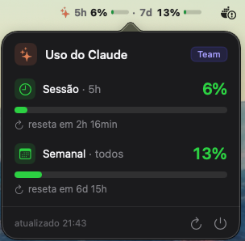

# ClaudeGauge

App de menu bar pro macOS que mostra o uso do seu Claude (limite de sessão de 5h e semanal) direto na barra do sistema — sem precisar abrir `claude.ai/settings/usage` toda hora.

- **Menu bar:** os dois limites de relance (`5h 81% ▬ · 7d 12% ▬`), com cor só na barra e texto que se adapta ao fundo claro/escuro
- **Popover:** sessão (5h), semanal, Opus e Sonnet — cada um com % em destaque, barra de progresso e countdown até o reset
- **Notificações** ao passar de 75% / 90% / 95%
- **Zero setup** se você já usa o Claude Code; ou login OAuth próprio pra quem não usa

## Screenshots



Na menu bar:


## Requisitos

- macOS 14 (Sonoma) ou superior
- Uma conta Claude (Pro / Max / Team)

## Instalação

### Opção 1 — Baixar o app pronto (mais fácil)

1. Baixe o `ClaudeGauge.zip` na página de [Releases](../../releases).
2. Descompacte e arraste **ClaudeGauge.app** para `/Aplicativos`.
3. Na primeira abertura: **clique com o botão direito no app → Abrir** (ou *Ajustes do Sistema → Privacidade e Segurança → Abrir Assim Mesmo*).

> Esse passo extra existe porque o app **não é notarizado pela Apple** (é um projeto gratuito). É seguro — o código é aberto aqui.

### Opção 2 — Compilar do código (pra devs)

```bash
git clone https://github.com/PedroHenriqueGazola/ClaudeGauge.git
cd ClaudeGauge
./scripts/make-app.sh
open ClaudeGauge.app
```

Requer Xcode (Swift 5.9+). Pra desenvolvimento rápido, `swift run` também funciona (sem notificações / abrir-no-login, que precisam do `.app`).

## Autenticação

Dois caminhos, nessa ordem de preferência:

1. **Login do app (OAuth):** em *Configurações → Conta → "Entrar com Claude"*, o app abre o navegador, você autoriza, copia o código exibido e cola de volta. O token fica no Keychain próprio do app e é renovado automaticamente. Funciona mesmo sem o Claude Code instalado.
2. **Claude Code (zero setup):** se você não fez login no app, ele reaproveita o token do Claude Code (`~/.claude/.credentials.json` ou Keychain).

> O login OAuth reusa o `client_id` público do Claude Code — é o único cliente aceito pelo endpoint de uso. Na prática o app se autentica "como se fosse o Claude Code". É a mesma abordagem dos apps do gênero, mas é uma área cinza de ToS e pode ser alterada pela Anthropic a qualquer momento. O app usa um par de tokens próprio, separado do CLI.

## Como funciona

Consulta o uso em `https://api.anthropic.com/api/oauth/usage` com um token OAuth. Se esse endpoint estiver indisponível, cai num fallback que faz uma chamada mínima em `/v1/messages` e lê o uso dos headers de rate limit. Tudo roda **localmente** na sua máquina — nenhum dado é enviado pra fora.

## Aviso

Os endpoints usados são **internos/não-oficiais** da Anthropic e podem mudar ou ser desativados sem aviso. É um projeto pessoal, não afiliado à Anthropic.

## Desenvolvimento

Com assinatura ad-hoc, cada rebuild muda a identidade do app e o macOS repede acesso ao Keychain. Pra evitar (só na sua máquina de dev): crie **uma vez** um certificado de code signing local chamado `ClaudeGauge Dev` (Acesso às Chaves → Assistente de Certificado → Criar um certificado → Autoassinado, tipo *Assinatura de código*). O `make-app.sh` passa a usá-lo automaticamente.

## Roadmap

- [ ] Developer ID + notarização (instalação limpa, sem aviso)
- [ ] Cask do Homebrew + auto-update (Sparkle)

## Licença

MIT
